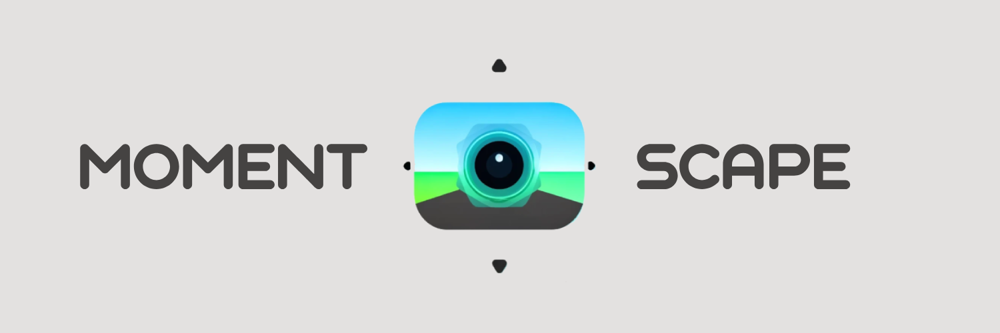

Have you ever looked at an old photo and thought about reliving the moment? Wouldn't you want to go inside the photo? Now, with **MomentScape**, you can.

## Introduction

MomentScape is a transformative experience designed to turn a photo into a personalized 3D environment that can be explored using a VR headset or through any browser. Inspired by our own experiences as international students, we longed for a way to connect with places and memories far away, such as our homes, family, and beloved pets. The ability to generate an interactive environment from our cherished photos has given us a comforting, immersive way to relive those moments.

## Motivation

As international students, being far from home can often feel isolating. While photos offer a window into memories, we wanted to break through that window and fully immerse ourselves in these precious moments. MomentScape arose from this desire to go beyond static images and create interactive, dynamic 3D environments. Whether it is reliving moments with pets, walking through the streets of our hometowns, or feeling a sense of connection to special places, MomentScape makes these experiences possible in a new, engaging way.

## Tech Stack Overview

**Backend:**
- **Flask Server**: The backend receives uploaded images and orchestrates the processing pipeline.
- **OpenAI API (GPT-4)**: Extracts context and texture information from the uploaded image, providing essential details for environment generation.
- **Stable Diffusion (Texture Generation)**: We use a fine-tuned diffuser model called [Dream Textures/Texture Diffusion](https://huggingface.co/dream-textures/texture-diffusion) to generate detailed textures based on contextual information.
- **InstantMesh**: The uploaded image is processed through [InstantMesh](https://github.com/TencentARC/InstantMesh), which identifies the primary subject, generates multiple angle views, and produces a detailed 3D mesh of the object.

- **A-Frame**: We use [A-Frame](https://aframe.io/), a three.js-based WebXR framework, to assemble the generated textures and 3D objects into an explorable environment. This allows users to experience their personalized scene in VR or through any browser.

**Frontend:**
- A simple, static site that enables users to upload images and access their generated environments.

### Repositories
- [Frontend Repository](https://github.com/MomentScape/frontend)
- [Backend Repository](https://github.com/MomentScape/backend)

## Current Status and Future Steps

MomentScape is currently a prototype that demonstrates the potential of generative AI to create personalized, immersive environments that traditionally require significant time and human effort. We are actively working to improve the fidelity of these environments and explore new capabilities, such as:

- **On-Device Inference** for quicker processing.
- **Custom Map Layouts and Sizes** to tailor environments to user preferences.
- **Multiple Object Recognition** for more comprehensive scene creation.
- **Depth Mapping** to accurately position objects within the generated environment.
- **Improved Lighting** based on light source identification in the image.
- **Ambient Sounds** to further enhance immersion and realism.

---

*Made with ❤️ at [Madhacks 2024](https://devpost.com/software/memoryscape-iaj7yz)*